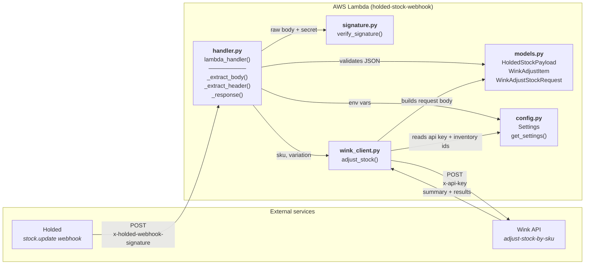
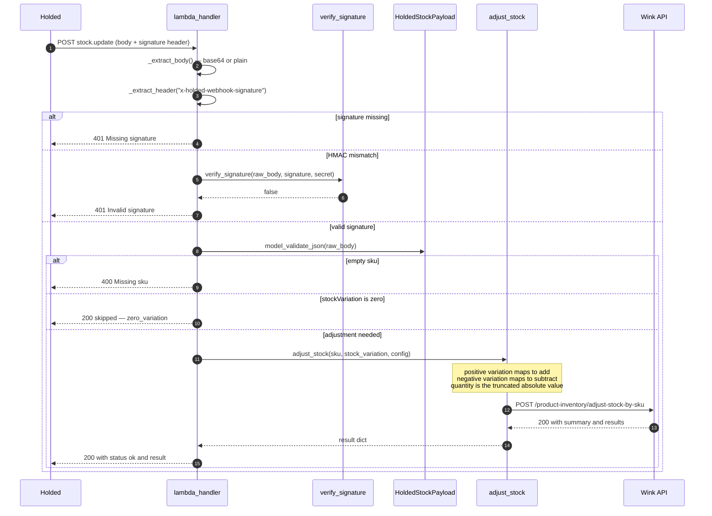
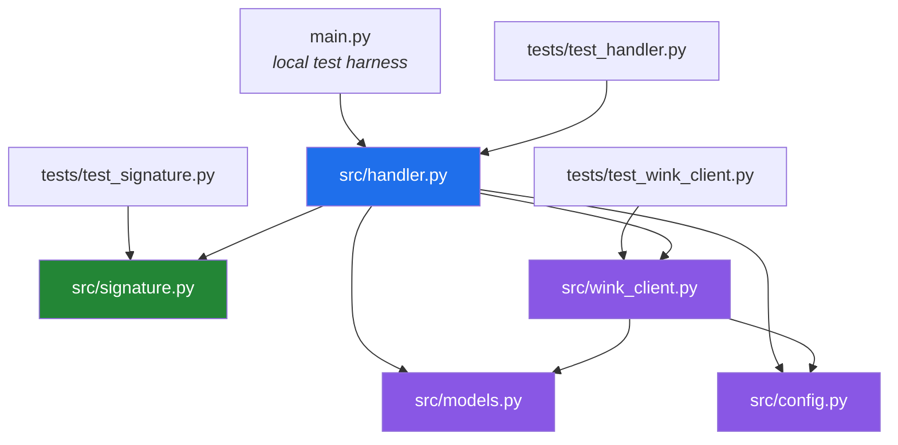

# Holded Stock Webhook

AWS Lambda that syncs stock changes from [Holded](https://www.holded.com/) to [Wink](https://www.winktienda.com/) via their APIs.

When a product's stock is updated in Holded, a `stock.update` webhook fires and this Lambda adjusts the stock on Wink by calling the `adjust-stock-by-sku` endpoint.

## Architecture



### Request flow



### Module dependencies



## Project Structure

```
src/
├── config.py        # Settings loaded from environment variables
├── models.py        # Pydantic models (Holded payload, Wink request)
├── signature.py     # HMAC-SHA256 webhook signature verification
├── wink_client.py   # httpx client for the Wink API
└── handler.py       # AWS Lambda entry point
tests/
├── test_handler.py      # 8 tests — routing, auth, error paths
├── test_signature.py    # 5 tests — HMAC verification
└── test_wink_client.py  # 5 tests — add/subtract mapping
main.py              # Builds a sample event and calls lambda_handler
```

## Prerequisites

- [Python 3.13+](https://www.python.org/downloads/)
- [uv](https://docs.astral.sh/uv/) (package manager)

## Setup

```bash
# Clone the repo
git clone <repo-url>
cd holded-stock-webhook

# Install dependencies
uv sync
```

## Environment Variables

Create a `.env` file from the example:

```bash
cp .env.example .env
```

| Variable | Description |
|----------|-------------|
| `HOLDED_WEBHOOK_SECRET` | Webhook signing secret from Holded (`whsec_...`) |
| `WINK_API_KEY` | API key from Wink Backoffice (API & Webhooks section) |
| `WINK_INVENTORY_IDS` | Comma-separated Wink inventory/sede IDs (e.g. `12`) |

## Testing

### Run all tests

```bash
uv run pytest tests/ -v
```

### Run a specific test file

```bash
uv run pytest tests/test_signature.py -v
uv run pytest tests/test_handler.py -v
uv run pytest tests/test_wink_client.py -v
```

### Run a specific test by name

```bash
uv run pytest tests/ -v -k "test_valid_signature"
uv run pytest tests/ -v -k "test_add_stock"
```

### Run tests with coverage

```bash
uv run pytest tests/ --cov=src --cov-report=term-missing
```

> **Note:** To run the coverage command, add `pytest-cov` to the dev dependencies in `pyproject.toml`.

### Lint and format

```bash
# Check lint
uv run ruff check src/ tests/ main.py

# Auto-fix lint issues
uv run ruff check --fix src/ tests/ main.py

# Check formatting
uv run ruff format --check src/ tests/ main.py

# Apply formatting
uv run ruff format src/ tests/ main.py
```

### Test locally

You can invoke the Lambda handler directly to verify it works end-to-end with real credentials:

```bash
uv run python main.py
```

This runs `main.py` which builds a sample event and calls `lambda_handler`. Make sure your `.env` file is configured before running.

## Webhook Behaviour

1. Holded fires a `stock.update` webhook when a product's stock changes.
2. The Lambda verifies the HMAC-SHA256 signature.
3. It parses the payload (SKU, stock variation).
4. It maps `stockVariation` to a Wink `add` or `subtract` operation.
5. It calls `POST https://api.winktienda.com/product-inventory/adjust-stock-by-sku`.

### Response codes

| Status | When |
|--------|------|
| `200` | Stock adjusted, or skipped because `stockVariation` was `0` |
| `400` | Payload has an empty `sku` |
| `401` | Signature header missing or HMAC mismatch |
| `500` | Unhandled error (Wink API failure, invalid JSON, missing config) |

## Deploying

Deployment is handled via GitHub Actions. Pushing to `main` triggers the CI/CD pipeline which runs tests and deploys the Lambda. See `.github/workflows/deploy.yml` for details.

## License

MIT
