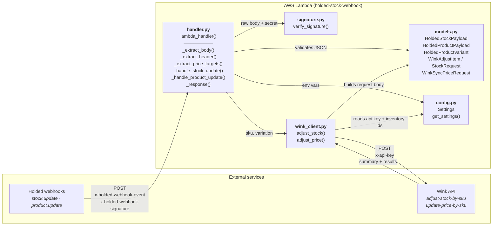
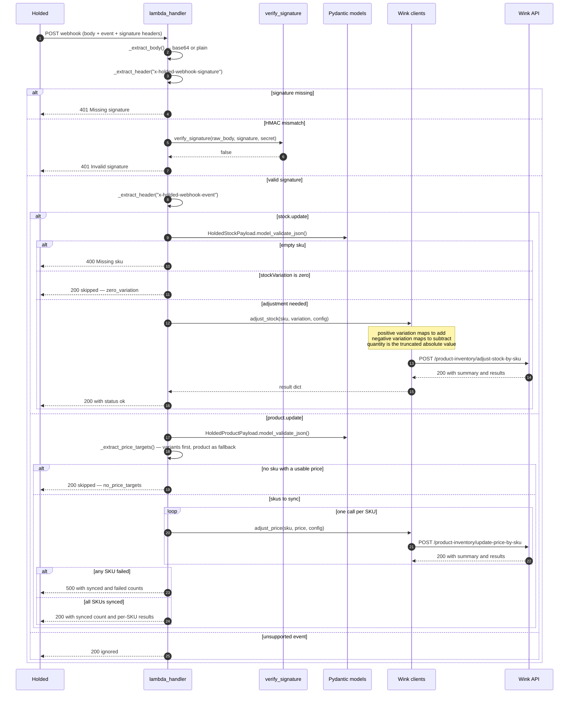
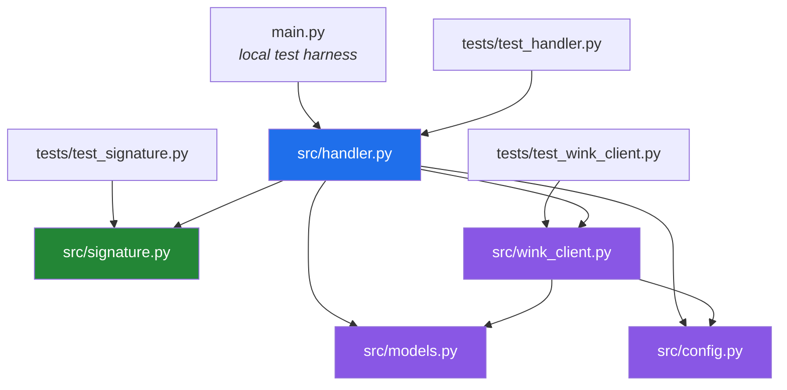
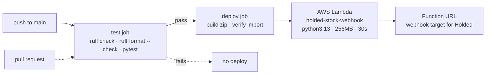

# Holded Stock Webhook

AWS Lambda that syncs stock changes from [Holded](https://www.holded.com/) to [Wink](https://www.winktienda.com/) via their APIs.

When a product's stock is updated in Holded, a `stock.update` webhook fires and this Lambda adjusts the stock on Wink by calling the `adjust-stock-by-sku` endpoint.

## Architecture



### Event routing

| `x-holded-webhook-event` | Action | Wink endpoint |
|--------------------------|--------|---------------|
| `stock.update` | Apply `stockVariation` as a delta | `adjust-stock-by-sku` |
| `product.update` | Push `price` for each SKU | `update-price-by-sku` |
| anything else | `200 {"status": "ignored"}` | — |

Signature verification runs **before** routing, so an unsigned or tampered event never reaches either Wink call.

### Request flow



### Module dependencies


## Project Structure

```
src/
├── config.py        # Settings loaded from environment variables
├── models.py        # Pydantic models (Holded payloads, Wink requests)
├── signature.py     # HMAC-SHA256 webhook signature verification
├── wink_client.py   # httpx clients: adjust_stock() and adjust_price()
└── handler.py       # AWS Lambda entry point + event routing
tests/
├── test_handler.py      # routing, auth, stock + price paths, error handling
├── test_signature.py    # HMAC verification
└── test_wink_client.py  # add/subtract mapping and price sync
main.py              # Builds signed sample events and calls lambda_handler
```

## Prerequisites

- [Python 3.13+](https://www.python.org/downloads/)
- [uv](https://docs.astral.sh/uv/) (package manager)

## Setup

```bash
# Clone the repo
git clone <repo-url>
cd holded-stock-webhook

# Install dependencies
uv sync
```

## Environment Variables

Create a `.env` file from the example:

```bash
cp .env.example .env
```

| Variable | Description |
|----------|-------------|
| `HOLDED_WEBHOOK_SECRET` | Webhook signing secret from Holded (`whsec_...`) |
| `WINK_API_KEY` | API key from Wink Backoffice (API & Webhooks section) |
| `WINK_INVENTORY_IDS` | Comma-separated Wink inventory/sede IDs (e.g. `12`) |

## Testing

### Run all tests

```bash
uv run pytest tests/ -v
```

### Run a specific test file

```bash
uv run pytest tests/test_signature.py -v
uv run pytest tests/test_handler.py -v
uv run pytest tests/test_wink_client.py -v
```

### Run a specific test by name

```bash
uv run pytest tests/ -v -k "test_valid_signature"
uv run pytest tests/ -v -k "test_add_stock"
```

### Run tests with coverage

```bash
uv run pytest tests/ --cov=src --cov-report=term-missing
```

> **Note:** To run the coverage command, add `pytest-cov` to the dev dependencies in `pyproject.toml`.

### Lint and format

```bash
# Check lint
uv run ruff check src/ tests/ main.py

# Auto-fix lint issues
uv run ruff check --fix src/ tests/ main.py

# Check formatting
uv run ruff format --check src/ tests/ main.py

# Apply formatting
uv run ruff format src/ tests/ main.py
```

### Test locally

You can invoke the Lambda handler directly to verify it works end-to-end with real credentials:

```bash
uv run python main.py
```

This runs `main.py` which builds a sample event and calls `lambda_handler`. Make sure your `.env` file is configured before running.

## Webhook Behaviour

1. Holded fires a `stock.update` or `product.update` webhook.
2. The Lambda verifies the HMAC-SHA256 signature before doing anything else.
3. It routes on the `x-holded-webhook-event` header.
4. `stock.update` → applies the `stockVariation` delta via `adjust-stock-by-sku`.
5. `product.update` → pushes `price` per SKU via `update-price-by-sku`.
6. Any other event is acknowledged with `200 {"status": "ignored"}` so Holded does not retry it.

### Price sync rules

- `price` arrives from Holded as a string (`"12.50"`) and is coerced to `float`.
- Variants win over the product: if any variant has a SKU and a price, only variants are synced. The product-level `sku`/`price` is used only as a fallback.
- SKUs that are empty, duplicated within the event, or have a `null`/negative price are dropped.
- Prices are absolute, so a Holded retry re-applies already-synced SKUs harmlessly.

### Response codes

| Status | When |
|--------|------|
| `200` | Stock adjusted, prices synced, or skipped (`zero_variation`, `no_price_targets`, `ignored`) |
| `400` | `stock.update` payload has an empty `sku` |
| `401` | Signature header missing or HMAC mismatch |
| `500` | Unhandled error, or at least one SKU failed during `product.update` |

## Deploying

Deployment is handled by `.github/workflows/deploy.yaml`.



The `test` job runs on every push and pull request. The `deploy` job has `needs: test`, so it only runs when the checks pass and only on `main` (never on pull requests). It can also be triggered manually with **Actions → CI/CD → Run workflow**.

### Required repository secrets

| Secret | Value |
|--------|-------|
| `AWS_ACCESS_KEY_ID` | IAM key with permission to update the Lambda |
| `AWS_SECRET_ACCESS_KEY` | Same IAM key's secret |
| `LAMBDA_ROLE_ARN` | Execution role ARN, only used when the function is first created |
| `HOLDED_WEBHOOK_SECRET` | Same value as `HOLDED_WEBHOOK_SECRET` in your local `.env` |
| `WINK_API_KEY` | Same value as `WINK_API_KEY` in your local `.env` |
| `WINK_INVENTORY_IDS` | Same value as `WINK_INVENTORY_IDS` in your local `.env` |

A missing secret fails the run with an explicit `::error::` message rather than deploying a broken function.

### What the deploy job does

1. Exports and installs production dependencies into `build/package` and copies `src/` alongside them.
2. Zips it (about 3 MB) and asserts that `src.handler.lambda_handler` imports from the built package, so a wrong handler path fails in CI instead of in production.
3. Creates the function on first run, or updates code and configuration on later runs.
4. Creates or updates the Function URL and makes it publicly invokable, then prints the URL.

The Lambda has no `.env` file: pydantic-settings reads `HOLDED_WEBHOOK_SECRET`, `WINK_API_KEY` and `WINK_INVENTORY_IDS` from the function's environment variables, which the workflow sets from the secrets above. Register the printed URL in Holded for the `stock.update` and `product.update` events.

The function URL uses `--auth-type NONE`, so requests are unauthenticated at the transport level. The HMAC signature check in the handler is the actual authentication, so `HOLDED_WEBHOOK_SECRET` must be set both in Holded and in the Lambda.


## License

MIT
